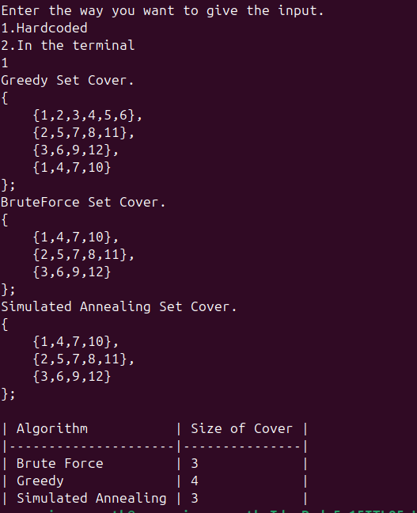
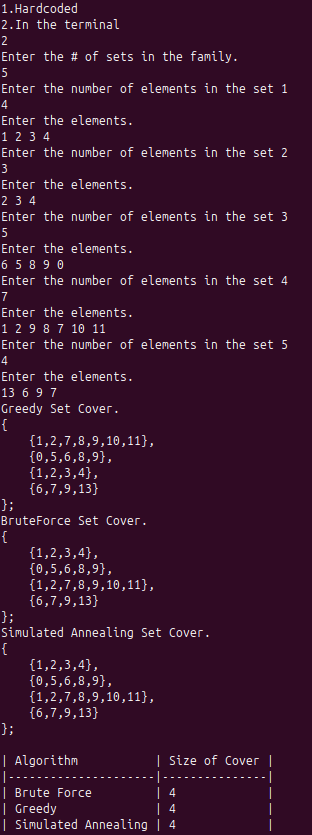

# Set Cover Solver in C++

This C++ project solves the **Set Cover Problem** (an NP-hard problem) using three approaches: **Brute Force**, **Greedy Approximation**, and **Simulated Annealing**.

---

## What is Set Cover?

Given:
- A universe set **X** = {x₁, x₂, ..., xₙ}
- A family of subsets **C** = {S₁, S₂, ..., Sₘ}, where each Sᵢ ⊆ X

A **set cover** is a subfamily **D ⊆ C** such that:

<div align="center"><strong>⋃<sub>S ∈ D</sub> S = X</strong></div>

The goal is to find a set cover **D** of **minimum size** (smallest number of sets).

---

## Features

- **Flexible Input System**  
  Supports either **hardcoded input** or **manual input** via terminal.

- **Brute Force Approach**  
  Tries all combinations to find the smallest valid cover.  
  ⚠️ Suitable only for **small input sizes** due to exponential time complexity.

- **Greedy Approximation**  
  Repeatedly selects the set covering the most remaining uncovered elements.  
  Guarantees solution size ≤ **ln(n) × OPT** (where OPT is the size of the optimal solution).

- **Simulated Annealing**  
  Uses probabilistic exploration to escape local minima and approach a near-optimal solution.  
  Uses configurable parameters: initial temperature, cooling rate, number of iterations.

---

## 📂 Project Structure

- `Setcover` class  
  - Maintains the universe `X` and family of sets `FS`
  - Implements all three algorithms: `BruteForce()`, `GreedyCover()`, and `Simulated_Annealing()`

- `main()` function  
  - Offers user choice for input method  
  - Runs all three algorithms and prints results  
  - Displays a table comparing the sizes of the resulting covers

---

## 🛠️ Compile & Run

```bash
g++ main.cpp -o set_cover
./set_cover
```
---
## 🚀 Future Plan

- Enable users to play with parameters of Simulated Annealing  
- Visualization of the data  

---
## 📊 Sample Output Format

Following are the sample inputs and output:
- 1.
  
- 2.
  
