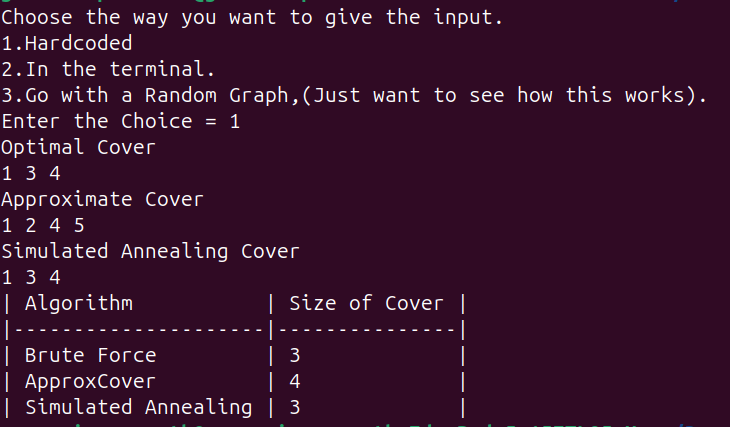
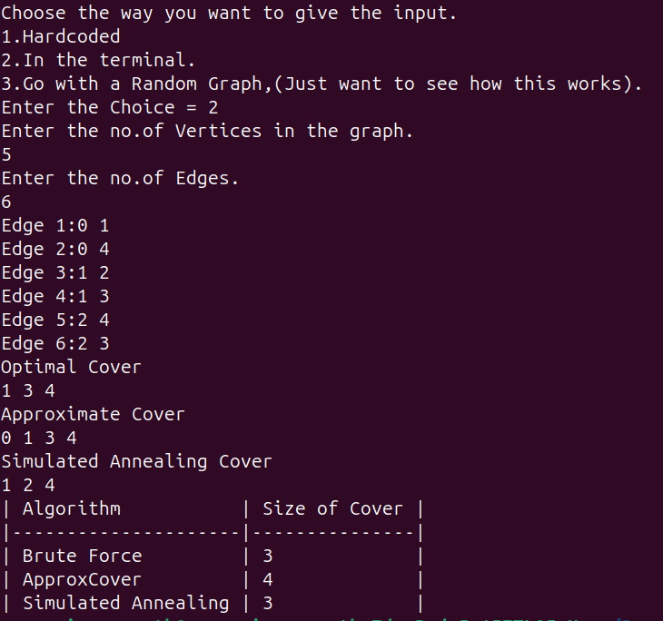
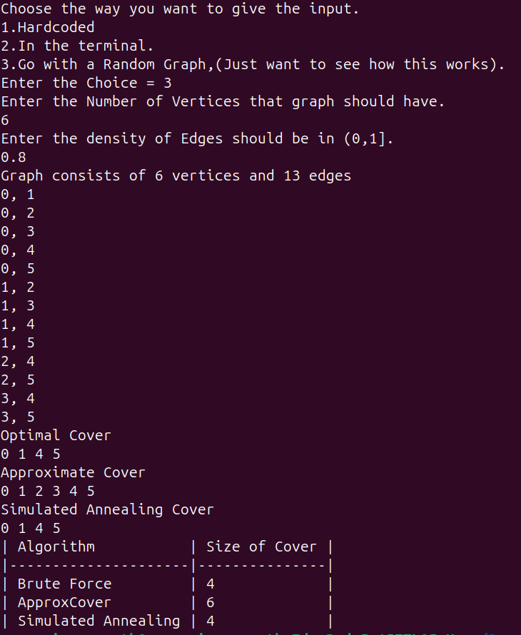

# 🧮 Vertex Cover Solver in C++

This C++ project solves the **Vertex Cover Problem** (an NP-complete problem) using multiple approaches: brute force, approximation, and simulated annealing.

---

## 🔍 What is Vertex Cover?

In a graph, a **vertex cover** is a set of vertices such that every edge has at least one endpoint in that set. The goal is to find the smallest such set.

---

## ✨ Features

- ✅ **Brute Force Approach**  
  Explores all possible subsets to find the minimum vertex cover.  
  ⚠️ Suitable only for small inputs due to exponential time.

- ⚡ **Approximation Algorithm**  
  Greedily picks random edges and includes both endpoints.  
  Guarantees a solution at most 2× the optimal.

- 🔥 **Simulated Annealing**  
  A stochastic metaheuristic that explores neighboring solutions to escape local minima.  
  Multiple iterations with cooling schedule help approach global optimal.

- 🎛️ **Flexible Input**  
  - Input via terminal  
  - Hardcoded edges  
  - Auto-generated random graphs with adjustable density

---

## 📂 Project Structure

- `Graph` class  
  - Builds and represents the undirected graph
  - Supports edge addition and random graph generation

- `VertexCover` class  
  - Implements the three algorithms to solve the problem

- `main()` function  
  - Offers user choice for input method  
  - Runs all three algorithms and prints results  
  - Displays a table comparing the sizes of the resulting covers

---

## 🛠️ Compile & Run

```bash
g++ main.cpp -o vertex_cover
./vertex_cover
```

---

## 🚀 Future Plan

- ✅ Enable users to play with parameters of Simulated Annealing  
- 📈 Visualization of the Graphs  

---

## 📊 Sample Output Format

Following are the sample inputs and output:
- 1.
  
- 2.
  
- 3.
  